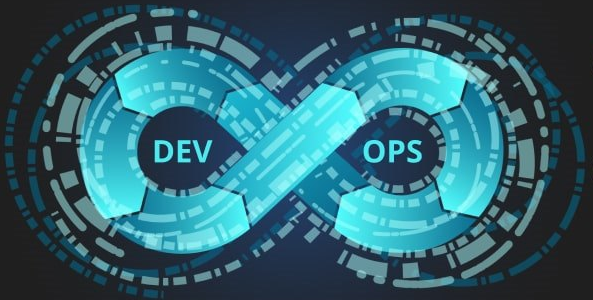
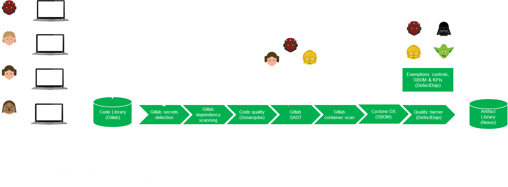

<p align="center">
    
</p>

<!-- PROJECT SHIELDS -->
[![Contributors][contributors-shield]][contributors-url]
[![Forks][forks-shield]][forks-url]
[![Stargazers][stars-shield]][stars-url]
[![Issues][issues-shield]][issues-url]
[![GNU License][license-shield]][license-url]

<!-- PROJECT LOGO -->
<br />
<p align="center">
  <a href="https://github.com/AntoineMeheut/ossf">
    
  </a>

  <h3 align="center">Open Source Software Factory</h3>
  <h3 align="center">THIS PROJECT IS CURRENTLY UNDER CONSTRUCTION!</h3>
  
  <p align="center">
    Principles, approach and installation of an open source software factory, to improve the quality and security of the code produced by a development team.
    <br />
    <a href="https://github.com/AntoineMeheut/blogame/issues">Report Bug</a>
    ·
    <a href="https://github.com/AntoineMeheut/blogame/projects">Request Feature</a>
  </p>
</p>

<!-- TABLE OF CONTENTS -->
# Table of Contents

* [About the Project](#about-the-project)
	* [My goals](#my-goals)
	* [Features](#features)
	* [Prerequisites](#prerequisites)
* [Needed Virtual Machines](#create-the-virtual-machines-we-need)
* [Gitlab CE & Runner installation](#gitlab-CE-&-Runner-installation)
* [Sonarqube installation](#sonarqube-installation)
* [DefectDojo installation](#defectDojo-installation)
* TODO
* [Roadmap](#roadmap)
* [Contributing](#contributing)
* [License](#license)
* [Contact](#contact)
* [Acknowledgements](#acknowledgements)

<!-- ABOUT THE PROJECT -->
# About this project
## My goals
By working in various startups and small development teams, I realized that these teams often lack the minimum tools
to improve the quality and security of their developments. The desire to do better is very real,
and only time and knowledge are holding them back.

## What we will build (in green)
<p align="center">
  <a href="https://github.com/AntoineMeheut/ossf">
    
  </a>
</p>

## Features
In this repository, I propose an approach to quickly set up and use a software factory built on open source tools.
The proposed architecture is very simple but not ready for production. It will allow you to analyze
and improve code very quickly. I use this architecture to conduct my own code audits.
This allows me to very quickly identify areas in the code where I will spend time digging and understanding.

This software factory is therefore built on:
- Gitlab Runner to orchestrate the CI pipeline,
- a step to search for secrets in the code (Gitlab secrets detection),
- a step to search for security vulnerabilities in imported dependencies (Gitlab dependency scanning),
- a step to do code quality analysis (Sonarqube), 
- a step to do static code security analysis (Gitlab SAST),
- a step to scan your images (Gitlab container scan),
- a step to create a SBOM of your project (Cyclon DX),
- and finally, a step that allows you to obtain a complete analysis report (DefectDojo).

## Prerequisites
This software factory is built on four virtual machines with an Ubuntu 20.04 server-type OS.

It is recommended to install docker on all four virtual machines, you can check it in a list of software
that the Ubuntu installer offers you.

```sh
--+------------------+------------------+------------------+-------------
  |192.168.1.XX      |192.168.1.XX      |192.168.1.XX      |192.168.1.XX
+-+------------+   +-+------------+   +-+------------+   +-+------------+
|[ VM1 ]       |   |[ VM2 ]       |   |[ VM3 ]       |   |[ VM4 ]       |
|(Gitlab-ce)   |   |(Sonarqube)   |   |(DefectDojo)  |   |(Nexus)       |
|2 Vcpu        |   |1 Vcpu        |   |1 Vcpu        |   |1 Vcpu        |
|4096 Ram      |   |4096 Ram      |   |2048 Ram      |   |2048 Ram      |
|80 Go disk    |   |50 Go disk    |   |50 Go disk    |   |50 Go disk    |
+--------------+   +--------------+   +--------------+   +--------------+
```

### First machine for Gitlab
The first machine contains:
- Gitlab-ce to load the code to be analyzed,
- Gitlab Runner to use pipelines to orchestrate code analysis,
- Gitlab secret detection,
- Gitlab dependency scanning for analyzing imported dependencies,
- Gitlab SAST for static code security analysis,
- Gitlab container scan to scan your images.

### Second machine for Sonarqube
The second machine contains:
- Sonarqube for code quality and security analysis.

### Third machine for DefectDojo
The third machine contains:
- DefectDojo, the tool that will enable DevSecOps analysis of your projects.

### Fourth machine for Nexus:
The fourth machine contains:
- The Nexus repository where we will store the builds from the CI chain.

Everything is orchestrated by pipelines in Gitlab.

<!-- SOFTWARE FACTORY INSTALLATION -->
## Create the virtual machines we need
Use your favorite virtualization tool to create these three machines. This documentation is intended
for Ubuntu OS version 20.04 LTS.

## Gitlab CE & Runner installation
### Use the following script and commands on the first VM
```shell
wget -O ~/gitlab-ubuntu-server-20.04.sh https://raw.githubusercontent.com/AntoineMeheut/ossf/refs/heads/main/install-gitlab-ce/gitlab-ubuntu-server-20.04.sh
```

```shell
sudo bash ~/gitlab-ubuntu-server-20.04.sh -d gitlab.ame.tech
```
## Sonarqube installation
### Use the following script and commands on the second VM
```shell
wget -O ~/sonarqube-ubuntu-server-20.04.sh https://raw.githubusercontent.com/AntoineMeheut/ossf/refs/heads/main/install-sonarqube/sonarqube-ubuntu-server-20.04.sh
```

```shell
sudo bash ~/sonarqube-ubuntu-server-20.04.sh
```

## DefectDojo installation
### Use the following script and commands on the third VM
```shell
wget -O ~/defectdojo-ubuntu-server-20.04.sh https://raw.githubusercontent.com/AntoineMeheut/ossf/refs/heads/main/install-defectdojo/defectdojo-ubuntu-server-20.04.sh
```

```shell
sudo bash ~/defectdojo-ubuntu-server-20.04.sh
```

## Nexus installation
### Use the following script and commands on the third VM
```shell
wget -O ~/nexus-ubuntu-server-20.04.sh https://raw.githubusercontent.com/AntoineMeheut/ossf/refs/heads/main/install-nexus/nexus-ubuntu-server-20.04.sh
```

```shell
sudo bash ~/nexus-ubuntu-server-20.04.sh
```

## Upload a project to your Gitlab
Once you have both your servers installed and have verified that you can access the URLs of your Gitlab and Sonarqube instances, upload one or two projects to your Gitlab.
# TODO

## Prepare your Gitlab CI
Use one of the Gitlab CI templates in this directory or upload your own.
# TODO

<!-- CONTRIBUTING -->
## Contributing

Contributions are what make the open source community such an amazing place to be learn, inspire, and create.
Any contributions you make are **greatly appreciated**.

1. Fork the Project
2. Create your Feature Branch (`git checkout -b feature/AmazingFeature`)
3. Commit your Changes (`git commit -m 'Add some AmazingFeature'`)
4. Push to the Branch (`git push origin feature/AmazingFeature`)
5. Open a Pull Request

<!-- LICENSE -->
## License

Distributed under the MIT License. See `LICENSE` for more information.

<!-- CONTACT -->
## Contact

If you want to contact me [just clic](mailto:github.contacts@protonmail.com)

Project Link: [https://github.com/AntoineMeheut/ossf](https://github.com/AntoineMeheut/ossf)

<!-- MARKDOWN LINKS & IMAGES -->
<!-- https://www.markdownguide.org/basic-syntax/#reference-style-links -->
[contributors-shield]: https://img.shields.io/github/contributors/AntoineMeheut/ossf?color=green
[contributors-url]: https://github.com/AntoineMeheut/ossf/graphs/contributors
[forks-shield]: https://img.shields.io/github/forks/AntoineMeheut/ossf
[forks-url]: https://github.com/AntoineMeheut/ossf/network/members
[stars-shield]: https://img.shields.io/github/stars/AntoineMeheut/ossf
[stars-url]: https://github.com/AntoineMeheut/ossf/stargazers
[issues-shield]: https://img.shields.io/github/issues/AntoineMeheut/ossf
[issues-url]: https://github.com/AntoineMeheut/ossf/issues
[license-shield]: https://img.shields.io/github/license/AntoineMeheut/ossf
[license-url]: https://github.com/AntoineMeheut/ossf/blob/master/LICENSE

