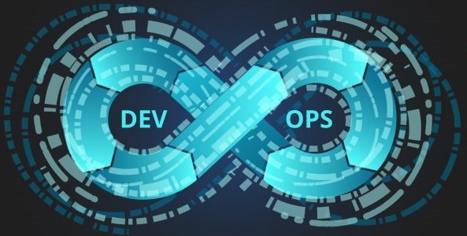
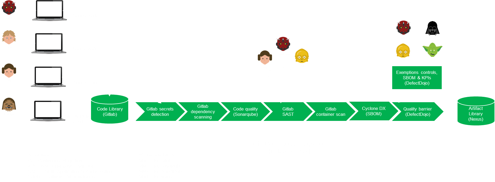

<p align="center">
  
</p>

# Open Source Software Factory

A small software factory built around GitLab CE, GitLab Runner, SonarQube
Community Build, Nexus Repository Community Edition and DefectDojo. This project
provides installation scripts sharing one private configuration file and starter
GitLab CI examples for a
lab or a small team's evaluation environment.



## Supported platform and versions

Use **Ubuntu Server 26.04.1 LTS**, with systemd, on **amd64 or arm64**. The
installers target the Ubuntu 26.04 release series. The following stable versions
were selected on **27 September 2026** and pinned so a later release does not
silently change a fresh installation.

| Component | Default version | Installation |
| --- | --- | --- |
| GitLab CE | 19.4.1 | Official Linux package |
| GitLab Runner | 19.4.1 | Official Linux package |
| SonarQube Community Build | 26.9.0.129388 | Official ZIP, native systemd service |
| SonarQube Java / database | OpenJDK 25 / PostgreSQL 18 | Ubuntu packages, current security updates |
| Nexus Repository | 3.96.3-01 | Official archive, bundled Java 21 |
| DefectDojo | 3.3.200 | Upstream Docker Compose release |
| DefectDojo database / cache | PostgreSQL 18.6 / Valkey 9.1.2 | Images pinned by upstream Compose |
| Docker Engine / Compose | 29.8.1 / 5.5.1 | Official stable APT repository |

The latest compatible Java version is used for SonarQube; Nexus keeps its
vendor-supplied runtime. Other Ubuntu dependencies receive the versions available
from the configured Ubuntu repositories.

Release and compatibility references: [Ubuntu 26.04](https://documentation.ubuntu.com/release-notes/26.04/),
[GitLab packages](https://docs.gitlab.com/install/package/),
[SonarQube downloads](https://www.sonarsource.com/products/sonarqube/downloads/),
[SonarQube Java requirements](https://docs.sonarsource.com/sonarqube-community-build/server-installation/server-host-requirements),
[Nexus downloads](https://help.sonatype.com/en/download.html),
[DefectDojo 3.3.200](https://github.com/DefectDojo/django-DefectDojo/releases/tag/3.3.200),
[Docker on Ubuntu](https://docs.docker.com/engine/install/ubuntu/).

## Prepare the machines

The suggested lab layout uses three machines:

| Machine | Services | Application ports |
| --- | --- | --- |
| 1 | GitLab CE, Runner, Docker, DefectDojo | GitLab HTTP 80, SSH 22; DefectDojo HTTP 8088, TLS 8443 |
| 2 | SonarQube, local PostgreSQL | SonarQube HTTP 9000 |
| 3 | Nexus | Nexus HTTP 8081 |

Size each machine for its workloads and the publishers' requirements; GitLab,
DefectDojo and build containers share machine 1's resources. Docker is needed on
machine 1, but not for the native SonarQube or Nexus installations. A separate
DefectDojo machine is also possible.

Start with fresh Ubuntu Server installations, configure DNS for GitLab, and copy
or clone this repository on each machine:

```sh
git clone https://github.com/AntoineMeheut/ossf.git
cd ossf
```

These scripts configure a lab over HTTP. Configure TLS, access controls, mail,
backups and external exposure for your deployment before using it in production.
GitLab Runner registration and the integrations between applications are separate
steps; installing the services does not create a complete analysis pipeline.

## One private configuration file

All five installers read **`config/ossf.env`** automatically. The tracked
[config/ossf.env.example](config/ossf.env.example) lists every supported key and
contains no passwords. Create the private file **once**, on your administration
workstation, with Bash and OpenSSL:

```sh
bash scripts/init-config.sh
# Edit the hostname and email addresses before installing:
${EDITOR:-vi} config/ossf.env
```

The initializer generates independent random administrator passwords, database
passwords and DefectDojo encryption keys, sets mode **600**, and never overwrites
an existing file. The private file is excluded from Git. Keep a protected backup
and copy **the same file** to `config/ossf.env` in the repository on each VM;
keep its permissions at 600. Keep the complete repository: the installers also
need `scripts/config.sh` and the configuration template.

The template and generated private file include English maintenance comments for
every variable: its VM, purpose, constraints and relationship to other services.
VM numbers refer to the layout above. In particular, SonarQube's local PostgreSQL
on VM 2 is separate from DefectDojo's PostgreSQL container on VM 1.

| VM | Purpose | Keys in `config/ossf.env` |
| --- | --- | --- |
| 1 | GitLab hostname and administrator | `GITLAB_DOMAIN`, `GITLAB_ADMIN_USER`, `GITLAB_ROOT_EMAIL`, `GITLAB_ROOT_PASSWORD` |
| 1 | GitLab and Runner packages | `GITLAB_VERSION`, `RUNNER_VERSION` |
| 1 | Docker and Compose | `DOCKER_VERSION`, `COMPOSE_VERSION` |
| 1 | DefectDojo installation and ports | `DEFECTDOJO_VERSION`, `INSTALL_DIR`, `DD_PORT`, `DD_TLS_PORT` |
| 1 | DefectDojo administrator | `DD_ADMIN_USER`, `DD_ADMIN_MAIL`, `DD_ADMIN_PASSWORD` |
| 1 | DefectDojo database | `DD_DATABASE_USER`, `DD_DATABASE_NAME`, `DD_DATABASE_PASSWORD` |
| 1 | DefectDojo persistent encryption/signing keys | `DD_SECRET_KEY`, `DD_CREDENTIAL_AES_256_KEY` |
| 2 | SonarQube archive | `SONARQUBE_ARCHIVE`, `SONARQUBE_SHA256` |
| 2 | SonarQube administrator | `SONARQUBE_ADMIN_USER`, `SONARQUBE_ADMIN_PASSWORD` |
| 2 | SonarQube PostgreSQL database | `SONARQUBE_DB_USER`, `SONARQUBE_DB_NAME`, `SONARQUBE_DB_PASSWORD` |
| 3 | Nexus version and administrator | `NEXUS_VERSION`, `NEXUS_ADMIN_USER`, `NEXUS_ADMIN_PASSWORD` |
| 1, 2, 3 | Readiness timeout in seconds | `WAIT_TIMEOUT` |

The initial GitLab account is `root`; the SonarQube and Nexus accounts are `admin`.
These three names must keep their template values. DefectDojo's admin name and the
SonarQube database user/name are configurable. Upstream DefectDojo Compose fixes
its database user and name to `defectdojo`.

The format is **literal `KEY=value`**, one line per setting: no `export`, quotes,
variable interpolation or inline comments. A line beginning with `#` is a comment;
`#` in a value is part of that value. Spaces, `$`, quotes and backslashes in a
password remain literal. Do **not** `source` the file. Passwords must contain at
least 16 printable ASCII characters; the AES key must contain 32 hexadecimal
characters. Applications may also enforce their own password-strength rules;
GitLab rejects predictable passwords even when they include punctuation. The
initializer supplies random values for all secrets.

For a file outside the checkout, supply its path explicitly:

```sh
sudo env OSSF_CONFIG=/etc/ossf/ossf.env \
  bash install-gitlab-ce/gitlab-ubuntu-server.sh
```

This works with every installer and the DefectDojo Compose wrapper. Settings are
read from the file; individual environment variables no longer override them.
The optional GitLab `-d` and SonarQube `--archive` arguments override only the
corresponding value for that invocation. No password needs to appear in a command.

## Machine 1: Docker, GitLab and DefectDojo

```sh
sudo bash install-docker/docker-ubuntu-server.sh
sudo bash install-gitlab-ce/gitlab-ubuntu-server.sh
sudo bash install-defectdojo/defectdojo-ubuntu-server.sh
```

The configuration defaults to port 8088 to avoid GitLab's internal port 8080.
Set `DD_PORT=8080` in the configuration if DefectDojo runs on a separate machine.

Set `GITLAB_DOMAIN` to your hostname, without a scheme, path or port.
The script sets GitLab's external URL before package installation. Register the
Runner afterwards with a runner authentication token from your GitLab instance.

Docker's installer configures its official signed APT repository and installs
Engine, CLI, Compose, Buildx and containerd. Existing conflicting distribution
packages are reported instead of removed automatically.

DefectDojo uses its upstream Compose configuration in `/opt/defectdojo`, with
matching release images, PostgreSQL and Valkey. The installer waits for successful
initialization, then starts the application and checks the login page. Credentials
and encryption keys come from the central configuration. The installer writes a
private runtime copy to `/opt/defectdojo/.ossf.env`; do not edit or source that
copy. Back up the central configuration together with the database and volumes.
Set `INSTALL_DIR`, `DD_PORT` and `DD_TLS_PORT` in the configuration before the
first installation.

Use the wrapper to operate Compose with exactly the same literal credentials:

```sh
sudo bash scripts/defectdojo-compose.sh ps
sudo bash scripts/defectdojo-compose.sh logs --tail 50 uwsgi
```

## Machine 2: SonarQube

```sh
sudo bash install-sonarqube/sonarqube-ubuntu-server.sh
```

SonarQube remains a native Java/systemd installation. The script downloads the
official ZIP, verifies its pinned SHA-256, installs JDK 25 and PostgreSQL 18,
creates a dedicated service account and database, applies Elasticsearch's kernel
and service limits, and waits for application status `UP`.

A local copy of the same official ZIP is also supported:

```sh
sudo bash install-sonarqube/sonarqube-ubuntu-server.sh \
  --archive /path/to/sonarqube-26.9.0.129388.zip
```

`SONARQUBE_ARCHIVE` in the configuration is equivalent to `--archive`. The default
checksum is pinned from the official HTTPS download; `SONARQUBE_SHA256` can override it with a trusted
expected checksum. A local archive still needs online access for Ubuntu packages.
A normal rerun with an empty `SONARQUBE_ARCHIVE` neither downloads nor requires
the archive. After startup, the installer replaces the initial admin password
with `SONARQUBE_ADMIN_PASSWORD` and verifies authentication.

## Machine 3: Nexus

```sh
sudo bash install-nexus/nexus-ubuntu-server.sh
```

The installer selects the architecture-specific archive, verifies the upstream
SHA-256 and uses Nexus's bundled Java runtime. The application runs under the
`nexus` account with data in `/opt/sonatype-work`. Once Nexus is ready, the
installer replaces its generated initial password with `NEXUS_ADMIN_PASSWORD`
and verifies administrator authentication.

## Credentials and repeated runs

`config/ossf.env` is the source of truth for deployment credentials. GitLab receives
its configured root password/email on the first package installation; SonarQube
and Nexus configure their administrator through their local APIs. DefectDojo's
initializer receives the configured admin account. Generated passwords are never
printed by the project scripts.

Applications still need runtime copies: SonarQube's JDBC properties/database
password file, GitLab's application secrets and DefectDojo's `.ossf.env`/container
environment. These are generated application state, not separate settings to
maintain manually. GitLab's `initial_root_password` file can expire; the configured
password remains available in the private configuration.

All installers require root and running systemd, stop on command errors and check
readiness. `WAIT_TIMEOUT` in the file sets the readiness timeout (default 900
seconds). `--help` works even before the configuration exists.

A second run of the same managed version preserves credentials and data. Saved
configuration fingerprints detect changed credentials and fail before package or
database changes. Changing a password in the file is **not** a password-rotation
procedure: follow the application's rotation procedure and keep the configuration
and managed state consistent afterwards.

For an installation created before the shared configuration was introduced,
first import its **actual** administrator passwords, database credentials,
DefectDojo keys, ports and account names. A newly generated file cannot recover
existing secrets. If SonarQube still uses `admin` / `admin`, keep a new strong
`SONARQUBE_ADMIN_PASSWORD`: the installer replaces that initial default.
Mismatching database/DefectDojo runtime settings are rejected;
GitLab's initial password option does not reset an existing account. Application
version upgrades and Ubuntu migrations still follow the publishers' procedures.

Version keys select releases for a fresh installation. Changing a default requires
upstream compatibility review and rerunning the tests; these keys are not an
application upgrade command.

## GitLab CI examples

Copy one file from `samples-gitlab-ci/` to a project's `.gitlab-ci.yml` and adapt
it to that project:

| Example | Runtime | Project prerequisites |
| --- | --- | --- |
| `AuditDocker.gitlab-ci.yml` | Docker 29.8.1 CLI and DinD | Dockerfile, container registry, privileged Docker executor sharing `/certs/client` |
| `AuditMaven.gitlab-ci.yml` | Maven 3.9.16, Temurin JDK 25 | Compatible `pom.xml`; `ci_settings.xml` and a deployment repository on the default branch |
| `AuditNpm.gitlab-ci.yml` | Node.js 26.10.0 | Scoped npm package and package registry access |
| `AuditPython.gitlab-ci.yml` | Python 3.14.7 | Package with test extras, tox `py`/`ruff` environments, Sphinx docs for Pages |

CI jobs use GitLab's **temporary job credentials**, which cannot be generated
in advance by the installation configuration:

| Example | Credentials supplied at job execution |
| --- | --- |
| Docker registry | `CI_REGISTRY_USER`, `CI_REGISTRY_PASSWORD`, `CI_REGISTRY` |
| npm package registry | `CI_JOB_TOKEN`, with the project's GitLab API URL/ID |
| Maven package registry | `CI_JOB_TOKEN`, referenced by the supplied `ci_settings.xml` |
| Python tests/build/Pages | No additional deployment credential is used |

For Maven, also copy [samples-gitlab-ci/ci_settings.xml](samples-gitlab-ci/ci_settings.xml)
to the project's root. Its server ID `gitlab-maven` must match your `pom.xml`
repository/distribution management ID. It reads the job token from the environment
using [GitLab's Maven registry authentication](https://docs.gitlab.com/user/packages/maven_repository/).
Do not upload the infrastructure administrator configuration to CI jobs. Runner
registration still uses an authentication token issued by GitLab after creating
a runner; registration is not performed by the installation script.

The examples build, test or publish application artifacts. They do not yet wire
SonarQube, vulnerability scanners, SBOM generation or DefectDojo report imports
together. Implement those jobs and configure their tokens for your own projects.
The Python deployment job is a placeholder to replace before enabling production
deployment.

## Validation

[Docker test instructions](tests/docker/README.md) describe how to run the actual
installers in disposable Ubuntu 26.04/systemd containers, including repeat runs
and failure handling. [Recorded results and limits](tests/docker/RESULTS.md)
distinguish executed checks from untested deployment scenarios.

## Contributing and license

Open an [issue](https://github.com/AntoineMeheut/ossf/issues) or a pull request with
the change and its validation. Distributed under the [MIT License](LICENSE).
Contact: [github.contacts@protonmail.com](mailto:github.contacts@protonmail.com).
